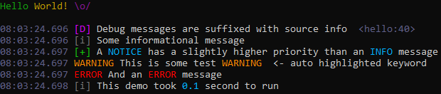

==========
coloration
==========

Yet another Python library for terminal and logs coloring and styling using ANSI
escape sequences (`ECMA-48`_).

Standalone library, no extra dependency required.

Main features:

* file-like wrapper
* ``logging.Handler`` class for automatically formatted and colored logs
* regex-based highlighting
* default behavior depends on whether output is written on a TTY
* text and binary streams both supported everywhere possible

Extra features:

* pre-defined ANSI codes for colors and styling
* auto-resetting of coloring and styling
* auto-stripping of ANSI escape sequences before writing
* Windows: easy enabling of VT100 emulation if needed
* `NO_COLOR <https://no-color.org/>`_ honored by default and overridable

Demo
====

.. code-block::

    python demos/hello.py

You should get a result similar to this:

By default, output format differs if you redirect output to a file::

    Hello World! \o/

    2021-01-21 08:03:39.045 [1048] DEBUG Debug messages are suffixed with source info  <hello:56>
    2021-01-21 08:03:39.045 [1048] INFO Some informational message  <hello:57>
    2021-01-21 08:03:39.045 [1048] NOTICE A NOTICE has a slightly higher priority than an INFO message  <hello:58>
    2021-01-21 08:03:39.045 [1048] WARNING This is some test WARNING  <- auto highlighted keyword  <hello:59>
    2021-01-21 08:03:39.045 [1048] ERROR And an ERROR message  <hello:60>
    2021-01-21 08:03:39.045 [1048] INFO This demo took 0.1 second to run  <hello:61>

Check out ``demos/`` directory.

Usage
=====

*coloration* can be installed from PyPI::

    python -m pip install -U coloration

Hello World
-----------

.. code-block:: python

    import coloration as color

    # Wrap std streams and enable VT100 emulation if on Windows and if needed
    color.init()

    # coloration.cprint() works pretty much like print(), except it deals with
    # coloration's AnsiCode objects and it resets attributes when done (colors
    # and styling)
    color.cprint(color.GREEN, "Hello", color.YELLOW, "World!")
    color.cprint("This message is not colored")

Colored Logging
---------------

.. code-block:: python

    import coloration
    import coloration.logging as logging

    coloration.init()

    logging.basicConfig(handlers=[logging.ColorationStreamHandler()])

    logger = logging.getLogger()

    logger.setLevel(logging.DEBUG)

    logger.debug("Debug messages are suffixed with source info")
    logger.info("Some informational message")
    logger.notice("A NOTICE has a slightly higher priority than an INFO message")
    logger.warning("This is some test WARNING  <- auto highlighted keyword")
    logger.error("And an ERROR message")

Highlighting
------------

.. code-block:: python

    import coloration

    coloration.init()

    hl = coloration.DefaultHighlighter()

    text = """
        Some keywords like False, True, None, DEBUG, INFO, NOTICE, WARNING, ERROR
        and OK are automatically highlighted with default highlighter, as well as
        UUIDs like 51605be1-b026-4bfe-8934-478092d04376, numbers like 123.4, IPv4
        addresses like 192.168.0.1 (IPv6 addresses supported), HTTP verbs like GET
        and POST, log marks like [i] and [+], and Python-like keyword-value pairs
        like some_var=True.
    """.rstrip()

    text = hl(text)

    print(text, end="")

License
=======

This project is distributed under the terms of the MIT license.
See the `LICENSE.txt <LICENSE.txt>`_ file for details.

.. _ECMA-48: https://www.ecma-international.org/publications-and-standards/standards/ecma-48/
